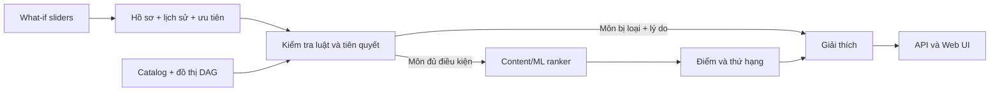

# Kế hoạch dự án — AI-07: Explainable Course Recommender

| Thuộc tính | Nội dung |
|---|---|
| Phiên bản | 1.0 |
| Ngày lập | 01/10/2026 |
| Nhóm thực hiện | 3–5 sinh viên |
| Thời lượng dự kiến | 12 tuần |
| Trạng thái | Kế hoạch triển khai |

## 1. Tóm tắt dự án

**Explainable Course Recommender** là hệ thống web gợi ý môn học cá nhân hoá cho sinh viên. Hệ thống đọc hồ sơ học tập, lịch sử điểm, mục tiêu nghề nghiệp và các ưu tiên của sinh viên để đề xuất các môn phù hợp cho kỳ tiếp theo.

Điểm cốt lõi không phải chỉ là danh sách gợi ý: mọi môn được đề xuất phải có **lý do có thể kiểm tra được**; mọi môn không đủ điều kiện phải bị loại với nguyên nhân cụ thể. Người dùng có thể thay đổi trọng số ưu tiên (ví dụ tăng “phù hợp định hướng”, giảm “dễ đạt điểm”) và nhận lại danh sách, điểm số cùng lời giải thích ngay trong lần yêu cầu đó.

Hệ thống kết hợp hai lớp:

1. **Luật cứng (rule-based eligibility):** kiểm tra tiên quyết, môn đã hoàn thành, giới hạn kỳ học và các ràng buộc đào tạo. Lớp này là cổng bắt buộc, không để mô hình xếp hạng vượt qua.
2. **Xếp hạng mềm (ML/content-based ranking):** tính độ phù hợp giữa môn học còn đủ điều kiện với mục tiêu và ưu tiên của sinh viên.

> Phạm vi dữ liệu là dữ liệu giả lập hoặc dữ liệu giáo dục công khai đã ẩn danh. Không dùng dữ liệu sinh viên thật nếu chưa có sự chấp thuận phù hợp.

## 2. Mục tiêu, tiêu chí thành công và phạm vi

### 2.1. Mục tiêu

- Tạo danh mục môn học và đồ thị tiên quyết không chu trình (DAG).
- Lưu và sinh hồ sơ, lịch sử học tập hợp lệ của sinh viên.
- Gợi ý danh sách môn cho một sinh viên/kỳ học, đảm bảo không vi phạm tiên quyết.
- Cung cấp lời giải thích theo từng gợi ý và từng môn bị loại.
- Cung cấp điều khiển What-if để thay đổi ưu tiên và cập nhật kết quả.
- Đánh giá chất lượng xếp hạng, độ đúng của luật và chỉ số công bằng trên tập kiểm thử tổng hợp.
- So sánh có căn cứ giữa baseline chỉ dùng luật và phương án lai Rules + ML.

### 2.2. Tiêu chí nghiệm thu cấp dự án

| Mã | Tiêu chí | Mức đạt tối thiểu |
|---|---|---|
| AC-01 | Không gợi ý môn thiếu bất kỳ tiên quyết bắt buộc nào | 100% trên bộ kiểm thử luật |
| AC-02 | Mỗi gợi ý có tối thiểu một lý do về điều kiện và một lý do về mức phù hợp | 100% API response hợp lệ |
| AC-03 | Thay đổi What-if làm thay đổi điểm/ranking khi trọng số có tác động | Có test tích hợp và demo trực tiếp |
| AC-04 | API gợi ý có thể truy vết đầu vào, phiên bản thuật toán và lý do | Có `request_id`, `algorithm_version`, `explanations` |
| AC-05 | Bộ dữ liệu lịch sử không tạo bản ghi điểm vi phạm đồ thị tiên quyết | 100% qua data-quality checks |
| AC-06 | Có báo cáo nêu metric ranking, fairness, giới hạn và so sánh baseline | Hoàn thành tuần 12 |
| AC-07 | Có thể khởi chạy toàn bộ hệ thống bằng Docker Compose | Một lệnh theo README |

### 2.3. Phạm vi phiên bản MVP

**Bao gồm**

- Đăng nhập demo hoặc chọn hồ sơ sinh viên mẫu.
- Danh mục môn, thông tin tín chỉ, mô tả, chủ đề, tiên quyết và kỳ được mở.
- Trang gợi ý môn cho kỳ tiếp theo; hiển thị điểm, thứ hạng và lời giải thích.
- Thanh trượt What-if cho: phù hợp định hướng, hỗ trợ cải thiện GPA, độ phù hợp khối lượng học, tính thực hành và mức độ an toàn/dễ hoàn thành.
- API quản trị dữ liệu ở mức demo và pipeline sinh/nạp dữ liệu.
- Dashboard/command xuất báo cáo đánh giá.

**Không bao gồm trong MVP**

- Đăng ký môn học thật hoặc tích hợp SIS/LMS của trường.
- Quyết định thay cố vấn học tập, xét tốt nghiệp hoặc cảnh báo học vụ chính thức.
- Collaborative filtering dựa trên người dùng thật quy mô lớn.
- Gọi LLM ở thời gian thực để ra quyết định xếp hạng.
- Thu thập hay lưu dữ liệu nhận dạng nhạy cảm không cần thiết.

## 3. Người dùng và các luồng nghiệp vụ

| Vai trò | Nhu cầu chính | Quyền trong MVP |
|---|---|---|
| Sinh viên | Xem môn đủ điều kiện, nhận gợi ý và thử các ưu tiên | Xem/chỉnh hồ sơ của mình, yêu cầu gợi ý |
| Cố vấn/giảng viên demo | Hiểu lý do hệ thống gợi ý | Xem gợi ý và giải thích của sinh viên được phân quyền |
| Quản trị dữ liệu | Quản lý catalog, tiên quyết, dữ liệu mẫu | CRUD catalog; chạy kiểm tra dữ liệu và nạp seed |
| Nhóm đánh giá | Tái lập kết quả thử nghiệm | Chạy benchmark, đọc báo cáo và cấu hình phiên bản |

### Luồng chính: nhận gợi ý

1. Sinh viên chọn kỳ học và xác nhận/chỉnh các ưu tiên.
2. Backend tải hồ sơ, các môn đã qua, catalog đang mở và ràng buộc đăng ký.
3. Rule engine loại môn đã học và môn không thoả toàn bộ tiên quyết; đồng thời lưu lý do loại.
4. Ranker chấm các môn còn hợp lệ theo đặc trưng hồ sơ, mục tiêu và trọng số What-if.
5. Explanation service dựng lý do từ các tín hiệu đã dùng; không tạo lý do sau khi xếp hạng một cách mâu thuẫn.
6. API trả danh sách có xếp hạng, giải thích, môn bị loại (tuỳ chọn hiển thị) và metadata tái lập.
7. Giao diện cho người dùng đổi slider và gửi lại yêu cầu; kết quả mới được đối chiếu với kết quả cũ.



## 4. Yêu cầu chức năng

| Mã | Yêu cầu | Ưu tiên |
|---|---|---|
| FR-01 | Quản lý catalog: mã môn, tên, tín chỉ, mô tả, chủ đề, cấp độ, kỳ mở và tải học dự kiến | Must |
| FR-02 | Khai báo và kiểm tra đồ thị tiên quyết, từ chối chu trình | Must |
| FR-03 | Lưu hồ sơ gồm chương trình học, kỳ hiện tại, lịch sử, mục tiêu và ưu tiên | Must |
| FR-04 | Xác định môn đủ điều kiện theo luật minh bạch | Must |
| FR-05 | Xếp hạng các môn hợp lệ theo mục tiêu và trọng số người dùng | Must |
| FR-06 | Trả lời giải thích cấu trúc cho môn được gợi ý và không được gợi ý | Must |
| FR-07 | Cập nhật gợi ý theo What-if không cần sửa dữ liệu gốc | Must |
| FR-08 | Sinh dữ liệu tổng hợp có ràng buộc logic và xuất CSV/seed database | Must |
| FR-09 | Ghi nhận phiên bản catalog, model và cấu hình xếp hạng trong mỗi lần chạy | Should |
| FR-10 | So sánh kết quả baseline Rules-only và Hybrid | Should |
| FR-11 | Quản lý danh mục và tiên quyết qua API quản trị | Could |

### 4.1. Quy tắc nghiệp vụ ban đầu

- Một môn chỉ được đưa vào ứng viên khi đang mở ở kỳ được chọn, chưa được hoàn thành và thoả **tất cả** tiên quyết dạng AND.
- Một tiên quyết được xem là đạt khi bản ghi học phần có trạng thái `passed` và điểm `>= 5.0` (cấu hình được).
- Đồ thị tiên quyết phải là DAG. Catalog có chu trình không được publish.
- Một môn bị chặn phải trả về mã luật và danh sách tiên quyết còn thiếu; ranker không được chấm để “lách” luật.
- Giới hạn tín chỉ là ràng buộc ở bước lập kế hoạch. MVP đề xuất từng môn; bản mở rộng có thể tối ưu tổ hợp môn trong giới hạn tín chỉ.
- Ưu tiên What-if có thang 1–5 và được chuẩn hoá về tổng trọng số 1 trước khi chấm điểm.

## 5. Kiến trúc và các quyết định kỹ thuật

### 5.1. Kiến trúc đề xuất

- **Frontend:** React + TypeScript + Vite; biểu đồ/slider và giao diện giải thích.
- **Backend:** Python 3.11+, FastAPI, Pydantic và SQLAlchemy/Alembic.
- **Cơ sở dữ liệu:** PostgreSQL. Dùng quan hệ chuẩn hoá cho catalog, lịch sử và tiên quyết.
- **Xử lý dữ liệu/ML:** pandas, NumPy, scikit-learn, NetworkX và Faker.
- **Triển khai:** Docker Compose cho `web`, `api`, `db`; `.env.example` không chứa bí mật.
- **Kiểm thử/CI:** pytest, httpx, Playwright/Vitest (tuỳ frontend), Ruff/Black, GitHub Actions hoặc CI tương đương.

### 5.2. ADR tóm tắt

| ADR | Quyết định | Lý do | Hệ quả chấp nhận |
|---|---|---|---|
| ADR-01 | FastAPI + PostgreSQL | Phù hợp dữ liệu quan hệ, validation rõ và tốc độ phát triển tốt | Cần migration và seed chuẩn |
| ADR-02 | Luật là lớp chặn trước ML | Bảo đảm tuân thủ tiên quyết và dễ giải thích | ML chỉ xếp hạng tập ứng viên hợp lệ |
| ADR-03 | Content-based là ranker đầu tiên | Synthetic data không có tương tác thật phong phú cho collaborative filtering | Không tuyên bố dự báo hành vi người học thật |
| ADR-04 | Explanation dựa trên feature/luật đã tính | Tránh “lời giải thích bịa sau kết quả” | Cần lưu contribution của từng feature |
| ADR-05 | LLM chỉ là tuỳ chọn để tạo goal text ngoại tuyến | Không phụ thuộc khoá API hay độ ổn định khi demo | Có template/rule generator thay thế |

### 5.3. Thành phần backend

| Thành phần | Trách nhiệm |
|---|---|
| Catalog service | Đọc/ghi môn học, kỳ mở, chủ đề và phiên bản catalog |
| Prerequisite service | Validate DAG, tìm tiên quyết thiếu, trả dấu vết kiểm tra |
| Profile service | Đọc hồ sơ, lịch sử và preference của sinh viên |
| Eligibility engine | Áp dụng luật cứng để tạo tập ứng viên và danh sách loại trừ |
| Ranking service | Biến đổi text/metadata thành feature, chấm và sắp xếp |
| Explanation service | Tạo `eligible_because`, `fit_reasons`, `blocked_reasons`, đóng góp điểm |
| Evaluation service | Ranking metrics, coverage, fairness checks và xuất báo cáo |
| Data pipeline | Sinh, validate, version và nạp dữ liệu tổng hợp |

## 6. Thiết kế dữ liệu

### 6.1. Thực thể chính

| Bảng | Trường quan trọng | Ghi chú |
|---|---|---|
| `students` | `id`, `program`, `current_term`, `anonymized_segment` | Không cần lưu tên thật trong dataset benchmark |
| `student_goals` | `student_id`, `goal_text`, `career_track`, `version` | Text được chuẩn hoá/kiểm duyệt nếu sinh tự động |
| `student_preferences` | `student_id`, 5 trọng số, `updated_at` | Lưu cấu hình mặc định, What-if request không bắt buộc lưu |
| `courses` | `code`, `name`, `credits`, `description`, `level`, `workload`, `offered_terms` | `code` duy nhất |
| `course_topics` | `course_id`, `topic`, `weight` | Phục vụ content matching |
| `course_prerequisites` | `course_id`, `prerequisite_course_id`, `min_grade` | Cạnh của DAG |
| `enrollments` | `student_id`, `course_id`, `term`, `status`, `grade` | Lịch sử học tập |
| `recommendation_runs` | `id`, `student_id`, `term`, `weights`, `algorithm_version`, `catalog_version` | Tái lập kết quả |
| `recommendation_items` | `run_id`, `course_id`, `rank`, `score`, `explanation_json` | Lưu snapshot demo/audit |

### 6.2. Hợp đồng dữ liệu và kiểm tra chất lượng

- `courses.code` không rỗng, duy nhất; `credits` là số nguyên dương; `workload` thuộc miền định nghĩa.
- Không cho phép `course_id = prerequisite_course_id`; NetworkX phải xác nhận `is_directed_acyclic_graph`.
- `enrollments.status = passed` bắt buộc có `grade >= pass_mark`; dữ liệu lịch sử phát sinh tuân theo thứ tự topo.
- Một sinh viên không có hai bản ghi kết quả cuối cùng khác nhau cho cùng môn/kỳ.
- Không đưa các thuộc tính nhạy cảm vào điểm xếp hạng. Nếu dùng `anonymized_segment` thì chỉ dùng khi đánh giá công bằng, không dùng làm feature.
- Mỗi dataset có `dataset_version`, seed ngẫu nhiên, thống kê phân phối và báo cáo validation.

### 6.3. Pipeline dữ liệu tổng hợp

1. Khai báo catalog nhỏ nhưng thực tế (khoảng 40–80 môn), chủ đề, số tín chỉ và DAG tiên quyết.
2. Dùng Faker tạo định danh giả và sinh 1.000–5.000 hồ sơ với seed cố định.
3. Duyệt DAG theo **topological sort**. Chỉ sinh điểm cho môn khi các môn cha đã đạt; nếu trượt/chưa học thì chặn toàn bộ hậu duệ phù hợp.
4. Sinh mục tiêu và ưu tiên bằng template có kiểm soát; ví dụ định hướng `Data Engineering`, `Backend`, `AI/ML`, kết hợp mục tiêu tải học và cải thiện điểm.
5. Tuỳ chọn: dùng LLM **ngoại tuyến** để tạo biến thể `goal_text`, bắt buộc JSON schema, lọc PII, kiểm tra thủ công mẫu và có template fallback.
6. Chạy data-quality checks, xuất CSV/Parquet và nạp vào PostgreSQL qua SQLAlchemy.

## 7. Thiết kế thuật toán gợi ý và giải thích

### 7.1. Rule engine

Đầu ra rule engine cần phân biệt rõ ba trạng thái:

- `eligible`: đang mở, chưa học và đạt mọi tiên quyết.
- `blocked`: không đủ tiên quyết, kèm môn thiếu/điểm chưa đạt.
- `not_applicable`: đã hoàn thành, không mở kỳ này hoặc ngoài chương trình học.

Ví dụ giải thích chặn: “Không đề xuất `DB301` vì còn thiếu tiên quyết `CS201 – Cấu trúc dữ liệu` (chưa hoàn thành).”

### 7.2. Ranker lai

Với mỗi môn đủ điều kiện, chuẩn hoá các feature về khoảng `[0, 1]`:

| Ký hiệu | Feature | Cách tính khởi đầu |
|---|---|---|
| `G` | Goal fit | Cosine similarity giữa embedding/TF-IDF của `goal_text` và mô tả + topic môn |
| `T` | Track fit | Độ khớp nhãn định hướng với topic môn |
| `P` | Performance support | Phù hợp khả năng thành công dự đoán đơn giản từ lịch sử môn nền tảng; giới hạn giải thích rõ |
| `W` | Workload fit | Độ gần giữa tải học mong muốn và tải học môn |
| `H` | Hands-on fit | Điểm thực hành theo metadata catalog |

Điểm phiên bản đầu:

`score = w_goal*G + w_track*T + w_performance*P + w_workload*W + w_hands_on*H`

Trong đó `w_*` được lấy từ slider, chuẩn hoá tổng bằng 1. Tie-break bằng mã môn để kết quả tái lập. Nếu cần mô hình ML có giám sát, dùng logistic regression hoặc gradient boosting được huấn luyện trên nhãn tổng hợp “môn được chọn/hoàn thành”; luôn benchmark với công thức tuyến tính để tránh phức tạp hoá vô ích.

### 7.3. Giải thích trung thực với phép tính

Mỗi item trả về các trường sau:

```json
{
  "course_code": "DB301",
  "rank": 1,
  "score": 0.84,
  "eligible_because": ["Đã đạt CS201 với điểm 7.5"],
  "fit_reasons": [
    {"factor": "goal_fit", "message": "Nội dung khớp định hướng Data Engineering", "contribution": 0.31},
    {"factor": "hands_on", "message": "Môn có tỷ trọng thực hành cao", "contribution": 0.18}
  ],
  "caveats": ["Tải học ước tính cao"],
  "algorithm_version": "hybrid-v1"
}
```

Lời giải thích chỉ được dùng những điều kiện và feature đã tính ở thời điểm xếp hạng. Không dùng LLM để tự bịa lý do; LLM, nếu có, chỉ được phép diễn đạt lại dữ liệu cấu trúc sau khi kiểm tra schema.

### 7.4. What-if controls

- Slider từ 1 đến 5 cho năm nhóm ưu tiên; UI hiển thị giá trị và nút “Đặt lại mặc định”.
- Khi gửi `POST /recommendations`, frontend gửi toàn bộ trọng số hiện tại; backend không ghi đè preference gốc trừ khi người dùng chọn lưu.
- Response có `previous_rank`/`rank_delta` khi UI yêu cầu đối chiếu, để người dùng thấy tác động của thay đổi.
- Debounce khoảng 300–500 ms và hiển thị trạng thái đang tính; mục tiêu demo API p95 dưới 500 ms trên tập dữ liệu seed.

## 8. API và giao diện

### 8.1. API tối thiểu

| Method | Endpoint | Mục đích |
|---|---|---|
| `GET` | `/health` | Kiểm tra tình trạng dịch vụ |
| `GET` | `/courses` | Danh sách/lọc catalog |
| `GET` | `/courses/{code}` | Chi tiết môn và tiên quyết |
| `GET` | `/students/{id}/profile` | Hồ sơ demo và lịch sử tóm tắt |
| `POST` | `/recommendations` | Rule check + ranking + explanation |
| `GET` | `/students/{id}/eligibility?term=` | Môn đủ điều kiện và bị chặn |
| `POST` | `/admin/catalog/validate` | Kiểm tra schema và DAG trước publish |
| `POST` | `/admin/data/seed` | Nạp dữ liệu mẫu, chỉ môi trường phát triển |
| `POST` | `/evaluation/run` | Chạy benchmark theo dataset/version |

Ví dụ body cho gợi ý:

```json
{
  "student_id": "stu_0105",
  "term": "2026-2",
  "limit": 10,
  "weights": {
    "goal": 5,
    "track": 4,
    "performance": 3,
    "workload": 2,
    "hands_on": 4
  }
}
```

### 8.2. Màn hình UI

1. **Trang chọn hồ sơ:** chọn sinh viên demo và kỳ học.
2. **Trang gợi ý:** danh sách xếp hạng, điểm, chip lý do, cảnh báo tải học và nút mở chi tiết.
3. **Bảng What-if:** năm slider, preset “Định hướng nghề nghiệp”, “Cân bằng tải học”, “Ưu tiên an toàn”; xem thay đổi thứ hạng.
4. **Trang điều kiện tiên quyết:** cây/đồ thị môn, trạng thái đã đạt/chưa đạt và lý do chặn.
5. **Trang quản trị demo:** nạp catalog/seed, xem validation và phiên bản dữ liệu.

Yêu cầu UX: không biểu đạt điểm gợi ý như một quyết định bắt buộc; luôn ghi rõ đây là hỗ trợ ra quyết định và hiển thị ràng buộc/giới hạn của kết quả.

## 9. Kiểm thử, đánh giá và fairness

### 9.1. Chiến lược kiểm thử

| Lớp | Nội dung | Ví dụ |
|---|---|---|
| Unit | Hàm chuẩn hoá, rule, score, explanation mapper | Trượt môn cha thì mọi môn con bị chặn |
| Property/data | Tính DAG, lịch sử sinh hợp lệ, không trùng mã môn | Sinh nhiều seed vẫn không có bản ghi vi phạm tiên quyết |
| Integration | API + PostgreSQL + pipeline | What-if làm thay đổi thứ hạng theo trường hợp kiểm soát |
| E2E | Luồng web từ chọn hồ sơ đến xem giải thích | Người dùng xem được lý do môn bị chặn |
| Regression | Bộ fixture cố định về ranking và giải thích | Cùng input/version cho cùng output |
| Security | Validation input, auth demo, bí mật môi trường | Không lộ connection string/API key |

### 9.2. Ranking metrics

Do dữ liệu tổng hợp không phải ground truth hành vi thật, metric được diễn giải là **tín hiệu kỹ thuật**, không phải bằng chứng hiệu quả giáo dục thực tế.

- `Precision@K`, `Recall@K`, `NDCG@K`: trên nhãn tổng hợp/hold-out có quy tắc công bố rõ.
- `Eligibility violation rate`: phải bằng 0.
- `Coverage`: tỷ lệ môn đủ điều kiện từng xuất hiện trong danh sách top-K trên quần thể phù hợp.
- `Diversity@K`: số/chỉ số đa dạng chủ đề để tránh danh sách quá đơn điệu.
- Độ ổn định: cùng request và seed/version phải cho cùng thứ hạng; đo biến động khi slider đổi một nấc.
- Latency: p50, p95 của endpoint gợi ý trên dữ liệu mục tiêu.

### 9.3. Fairness checks

- Chỉ dùng nhóm đã ẩn danh hoặc các cohort kỹ thuật hợp lý (năm học/chương trình) để đo; không dùng chúng để xếp hạng.
- So sánh theo nhóm: coverage, tỷ lệ được đề xuất môn nâng cao, điểm trung bình top-K, eligibility rate và latency.
- Đặt ngưỡng cảnh báo về chênh lệch tuyệt đối (ví dụ 10 điểm phần trăm) để điều tra, không tự động kết luận có thiên vị.
- Kiểm tra nguồn gốc chênh lệch: dữ liệu lịch sử, catalog, luật hay ranker. Mọi kết luận phải ghi giới hạn của synthetic data.

### 9.4. So sánh Rules-only và Hybrid

| Phương án | Điểm mạnh | Hạn chế | Cách đánh giá |
|---|---|---|---|
| Rules-only | Tuân thủ tuyệt đối, dễ kiểm tra | Không cá nhân hoá thứ tự ưu tiên | Eligibility, coverage ngẫu nhiên/baseline |
| Hybrid Rules + content/ML | Cá nhân hoá, có thứ hạng và What-if | Phụ thuộc chất lượng feature/dữ liệu | NDCG/coverage/diversity, explanation consistency |

Kết luận ADR/report chỉ được khẳng định Hybrid tốt hơn khi có metric và scenario tái lập hỗ trợ; không suy rộng sang kết quả học tập thật.

## 10. Lộ trình triển khai 12 tuần

| Giai đoạn | Tuần | Công việc chính | Sản phẩm bàn giao | Điều kiện hoàn tất |
|---|---:|---|---|---|
| 1. Khởi tạo & kiến trúc | 1–2 | Chốt scope, user story, schema, ADR, repo, Docker, CI, API contract | ADR, ERD, OpenAPI nháp, skeleton chạy được | Compose khởi động; DAG validator có test |
| 2. Xây dựng dữ liệu | 3–4 | Catalog, graph, generator Faker/NumPy, ETL, data quality | Dataset version 0.1 và báo cáo validation | 1.000+ hồ sơ hợp lệ; không có cycle/vi phạm prerequisite |
| 3. Backend core | 5–7 | Models/migrations, eligibility engine, baseline ranker, API | API gợi ý và test integration | AC-01, AC-02 trên fixture |
| 4. Explainability & What-if | 8–9 | Contribution score, endpoint weights, audit run, so sánh request | JSON explanations và demo API What-if | Slider input thay đổi score/rank đúng fixture |
| 5. Frontend & UI | 10–11 | Trang hồ sơ, gợi ý, giải thích, slider, đồ thị tiên quyết | Web UI containerised | Hoàn tất E2E happy path |
| 6. Đánh giá & hoàn thiện | 12 | Benchmark, fairness, tối ưu, bảo mật cơ bản, tài liệu/demo | Báo cáo cuối, video/script demo, release tag | Toàn bộ acceptance criteria đạt |

### Mốc kiểm soát

- **Cuối tuần 2:** không bắt đầu UI lớn khi schema, luật pass mark và contract API chưa được chốt.
- **Cuối tuần 4:** khoá `dataset-v0.1`; bất kỳ thay đổi schema sau đó cần migration và cập nhật data contract.
- **Cuối tuần 7:** API core ổn định; frontend dùng mock chỉ khi endpoint chưa sẵn sàng.
- **Cuối tuần 9:** freeze thuật toán `hybrid-v1` cho đánh giá; thay đổi sau freeze phải chạy lại benchmark.
- **Cuối tuần 11:** feature freeze, chỉ sửa lỗi và hoàn thiện tài liệu trừ trường hợp được nhóm phê duyệt.

## 11. Phân công nhóm 3–5 người

| Vai trò | Trách nhiệm chính | Bàn giao |
|---|---|---|
| Thành viên A — Tech lead/backend | Kiến trúc, API, DB, Docker, review | ADR, API, migration, Compose |
| Thành viên B — Data/ML | Catalog/DAG, generator, ranker, benchmark | Dataset, pipeline, metric report |
| Thành viên C — Frontend/UX | UI gợi ý, What-if, đồ thị/giải thích, E2E | Giao diện và test UI |
| Thành viên D — QA/DevOps (nếu có) | Test plan, CI, data checks, bảo mật và demo | Dashboard test, release checklist |
| Thành viên E — Product/docs (nếu có) | User story, tài liệu, đánh giá fairness, demo | Report, hướng dẫn sử dụng, slide |

Với nhóm 3 người, A phụ trách DevOps, B phụ trách QA dữ liệu và C phụ trách tài liệu/UI testing. Mọi pull request cần ít nhất một người khác review; thay đổi rule hoặc schema cần cập nhật test và ADR tương ứng.

## 12. Quản trị dự án và cách làm việc

- Làm việc theo sprint 1 tuần: lập kế hoạch đầu tuần, demo nội bộ giữa/cuối tuần, retrospective ngắn.
- Dùng issue có acceptance criteria, estimate và liên kết pull request; board tối thiểu `Backlog → In progress → Review → Done`.
- Quy ước Git: nhánh `feature/<issue>-<short-name>`, PR nhỏ, CI pass trước merge vào `main`.
- Mỗi release tạo tag, changelog ngắn, dataset/model/catalog version và cách tái lập.
- Definition of Done: mã qua lint + test liên quan, API/type contract cập nhật, tài liệu cập nhật, không hard-code secret, được review.

### Cấu trúc repository đề xuất

```text
.
├── apps/
│   ├── api/                 # FastAPI, migrations, tests
│   └── web/                 # React/TypeScript
├── data/
│   ├── raw/                 # chỉ dữ liệu công khai/metadata, không commit PII
│   ├── generated/           # seed/manifest của dữ liệu tổng hợp
│   └── schemas/
├── ml/
│   ├── features/
│   ├── evaluation/
│   └── models/              # artefact nhỏ/version manifest
├── docs/
│   ├── adr/
│   ├── api/
│   └── evaluation/
├── docker-compose.yml
├── .env.example
└── README.md
```

## 13. Rủi ro và biện pháp giảm thiểu

| Rủi ro | Tác động | Phòng ngừa/ứng phó | Chủ sở hữu |
|---|---|---|---|
| Catalog/tiên quyết sai hoặc có chu trình | Cao | Version catalog, validator DAG, test fixture, review thủ công | Data/Backend |
| Dữ liệu giả không phản ánh quy tắc | Cao | Topological generation, quality checks, seed cố định, báo cáo phân phối | Data/ML |
| “ML” không có nhãn đáng tin | Cao | Dùng content-based baseline, diễn giải đúng giới hạn, không thổi phồng kết quả | Data/ML |
| Lời giải thích không khớp score | Cao | Dựng explanation từ trace/contribution đã tính, regression tests | Backend |
| LLM lỗi, tốn chi phí hoặc lộ dữ liệu | Trung bình | LLM chỉ offline và optional; template fallback; không gửi PII | Tech lead |
| Scope UI/thuật toán phình to | Trung bình | Đóng băng MVP tuần 2, ưu tiên AC-01…AC-07 | Product/nhóm |
| Cài đặt môi trường khác nhau | Trung bình | Docker Compose, lockfile, `.env.example`, hướng dẫn seed | DevOps |
| Kết quả fairness bị hiểu quá mức | Trung bình | Tách đánh giá synthetic vs thực tế, ghi giới hạn trong báo cáo | QA/Docs |

## 14. Bảo mật, riêng tư và đạo đức

- Dùng ID giả/UUID trong demo; không đưa tên, email, mã số sinh viên thật vào repository hay log.
- Xác thực và phân quyền tối thiểu nếu có tài khoản; endpoint quản trị phải tách khỏi luồng sinh viên.
- Validate toàn bộ input API, giới hạn phân trang/rate ở môi trường triển khai và dùng query parameter hoá qua ORM.
- Secrets chỉ nằm trong biến môi trường/secret manager; commit `.env.example` nhưng không commit `.env`.
- Log audit chỉ giữ metadata cần thiết (`request_id`, version, timestamp), không log toàn văn mục tiêu nếu không cần.
- Hiển thị chú thích: hệ thống là công cụ hỗ trợ, không thay thế cố vấn; người dùng có quyền biết lý do và phản hồi khi thấy kết quả không phù hợp.

## 15. Kế hoạch demo và tài liệu bàn giao

### Kịch bản demo 8–10 phút

1. Nêu bài toán, giới hạn dữ liệu và kiến trúc lai Rules + ML.
2. Mở catalog/đồ thị, chỉ ra một quan hệ tiên quyết.
3. Chọn sinh viên đã qua môn cha và xem danh sách gợi ý có lý do.
4. Chọn một môn bị chặn để chứng minh hệ thống nêu đúng tiên quyết thiếu.
5. Tăng trọng số “định hướng Data Engineering”, đối chiếu thứ hạng và contribution trước/sau.
6. Chạy/hiển thị báo cáo eligibility, ranking, coverage và fairness; giải thích giới hạn metric tổng hợp.
7. Khởi chạy từ môi trường sạch bằng Docker Compose hoặc trình bày lệnh tái lập.

### Artefact bàn giao

- Source code, lockfile, Docker Compose và `.env.example`.
- README cài đặt/chạy/seed/test/demo.
- ERD, OpenAPI, ADR-001 đến ADR-005 và data dictionary.
- Dataset manifest: nguồn, giấy phép (nếu có), seed, schema, version và báo cáo chất lượng.
- Test report, benchmark ranking/fairness, bảng so sánh Rules-only/Hybrid.
- Video hoặc slide demo và danh sách giới hạn/việc tiếp theo.

## 16. Backlog mở rộng sau MVP

- Tối ưu **tổ hợp** môn học theo ràng buộc tổng tín chỉ, lịch học và mức tải thay vì chỉ xếp hạng từng môn.
- Hỗ trợ OR-prerequisite, corequisite, miễn điều kiện và nhiều chương trình đào tạo.
- Thu nhận feedback rõ ràng từ người dùng để hiệu chỉnh ranker với cơ chế đồng thuận/ẩn danh.
- Hiển thị counterfactual hữu ích: “Bạn cần hoàn thành môn X để đủ điều kiện cho Y”, thay vì chỉ báo bị chặn.
- So sánh thêm model với feature store/version registry nếu dữ liệu thực được phê duyệt.
- Tích hợp hệ thống đào tạo chính thức chỉ sau đánh giá bảo mật, pháp lý và quản trị dữ liệu.

## 17. Checklist khởi động ngay tuần 1

- [ ] Xác nhận với giảng viên phạm vi catalog, ngưỡng qua môn và cách diễn giải tiên quyết AND/OR.
- [ ] Chốt 3–5 vai trò và lập board công việc.
- [ ] Tạo repository, README, `.gitignore`, Docker Compose và CI tối thiểu.
- [ ] Viết ADR-001 đến ADR-005 từ các quyết định ở mục 5.2.
- [ ] Hoàn thành data dictionary và một catalog mẫu 10 môn có DAG.
- [ ] Viết test xác nhận cycle bị từ chối và `passed >= 5.0` mới mở khoá môn con.
- [ ] Chốt OpenAPI body/response của `POST /recommendations`.
- [ ] Chọn 10 scenario kiểm thử giải thích và What-if để trở thành regression fixtures.

---

Tài liệu này được lập từ nội dung mô tả dự án AI-07 trong `KeHoach.pdf`. Các prompt/hướng dẫn hội thoại xuất hiện trong PDF chỉ được xem là ngữ cảnh tham khảo; phạm vi, quyết định và tiêu chí thực hiện ở trên là kế hoạch triển khai của nhóm.
