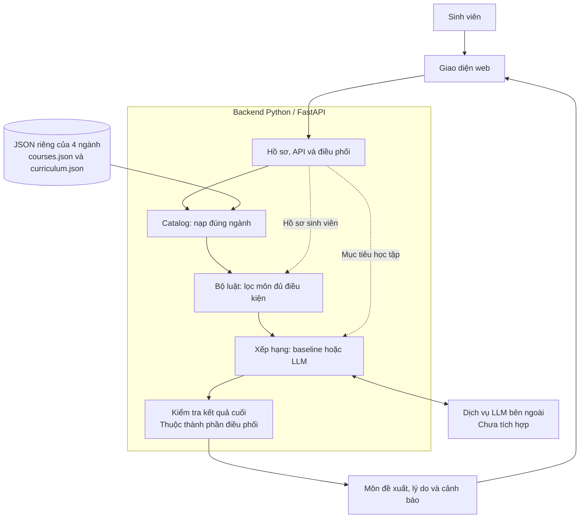

# Kiến trúc hệ thống gợi ý môn học

Kiến trúc mô tả các thành phần của ứng dụng và cách trao đổi dữ liệu, không mô tả ai được giao việc. Đặc tả thành phần nằm trong [modules/](../modules/README.md); nhân sự và nhánh Git nằm trong [bản chia việc](PHAN_CHIA_CONG_VIEC.md).

## Sơ đồ chức năng

## Luồng xử lý một yêu cầu

1. Giao diện gửi ngành, môn đã qua, mục tiêu, giới hạn tín chỉ và số môn muốn gợi ý.
2. API nạp catalog của đúng ngành và từ chối mã môn đã qua không thuộc catalog đó.
3. Bộ luật đọc tiên quyết/quy định trong dữ liệu để xác định tập ứng viên.
4. Bộ xếp hạng nhận tập ứng viên và mục tiêu, không nhận cả bốn catalog. Dùng baseline khi chưa có LLM hoặc dịch vụ lỗi.
5. Thành phần điều phối kiểm tra mã môn, trùng lặp và tổng tín chỉ trước khi trả kết quả. Kiểm tra đầy đủ hướng học, nhóm và phương án tốt nghiệp của danh sách cuối còn cần hoàn thiện.
6. Giao diện hiển thị kết quả. What-if chạy lại với đầu vào khác, không sửa catalog.

## Ranh giới dữ liệu và code

- `courses.json` lưu môn và tiên quyết; `curriculum.json` lưu quy định chương trình. Code kiểm tra chung, không viết cứng chỉ tiêu của từng ngành.
- `source_rows.json` là dữ liệu đối chiếu/sinh catalog, không phải đầu vào runtime của mỗi lần gợi ý.
- Catalog không xếp hạng; bộ luật không gọi LLM; LLM không quyết định điều kiện học; UI không thay thế bộ luật backend.
- Các module hiện ở trong một ứng dụng FastAPI, không phải năm microservice. Không cần database hay train model riêng trong phạm vi bản nền.

## Trạng thái hiện tại

Đã có catalog của bốn ngành, API, giao diện, bộ lọc cơ bản và `KeywordRanker`. Chưa có adapter LLM, lý do cá nhân hóa, xử lý đầy đủ hướng học/phương án tốt nghiệp hoặc so sánh hai tình huống what-if. Sơ đồ thể hiện kiến trúc mục tiêu; phần chưa có được ghi rõ trong đặc tả từng module.
