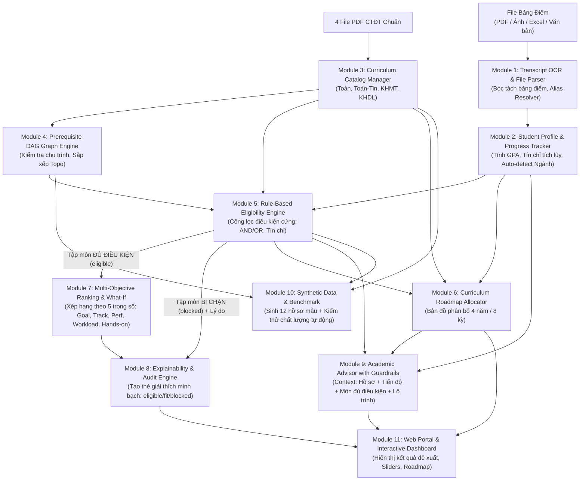

# KIẾN TRÚC HỆ THỐNG THEO MODULE — Explainable Course Recommender (AI-07)

Hệ thống được thiết kế theo nguyên lý **phân tách trách nhiệm cao (High Cohesion, Loose Coupling)**. Mỗi module là một thành phần phần mềm chức năng độc lập, có ranh giới rõ ràng, có hợp đồng dữ liệu (Data Contract), thuật toán xử lý và bộ kiểm thử riêng biệt.

> **LƯU Ý VỀ TỔ CHỨC:**
> Thư mục `modules/` này đặc tả **11 Module kiến trúc phần mềm thực tế** của hệ thống.
> Nội dung phân công 5 người làm việc trước đây đã được chuẩn hóa về đúng vị trí tại [Bản phân chia công việc](../docs/PHAN_CHIA_CONG_VIEC.md).

---

## 1. Bản đồ 11 Module Kiến trúc Hệ thống

| STT | Mã Module | Tên Module | Trách nhiệm chính | Hiện trạng thực tế | Đặc tả chi tiết |
|---|---|---|---|:---:|---|
| **01** | `transcript_parser` | **Transcript OCR & File Parser** | Bóc tách tự động bảng điểm từ file tải về (PDF, Ảnh chụp, Excel/CSV), OCR, chuẩn hóa mã môn | **Chưa làm (0%)** | [01-transcript-parser.md](01-transcript-parser.md) |
| **02** | `student_profile` | **Student Profile & Progress Tracker** | Quản lý hồ sơ học vụ, tính tổng tín chỉ tích lũy, GPA thang 10 & 4, tự động nhận diện ngành học | **Đã xong 80%** | [02-student-profile.md](02-student-profile.md) |
| **03** | `curriculum_catalog` | **Curriculum Catalog Manager** | Quản lý tri thức 4 CTĐT (Toán, Toán-Tin, KHMT&TT, KHDL), cơ cấu khối kiến thức và tín chỉ | **Đã xong 95%** | [03-curriculum-catalog.md](03-curriculum-catalog.md) |
| **04** | `prerequisite_graph` | **Prerequisite DAG Graph Engine** | Mô hình hóa đồ thị tiên quyết có hướng, kiểm định chu trình (Cycle Detection), sắp xếp Topo | **Đã xong 50%** | [04-prerequisite-graph.md](04-prerequisite-graph.md) |
| **05** | `eligibility_rules` | **Rule-Based Eligibility Engine** | Cổng kiểm tra điều kiện cứng (tiên quyết AND/OR, hạn mức tín chỉ), bảo đảm tỷ lệ vi phạm = 0% | **Đã xong 85%** | [05-eligibility-rules.md](05-eligibility-rules.md) |
| **06** | `roadmap_planner` | **Curriculum Roadmap Allocator** | Phân bổ toàn bộ môn học vào 4 năm / 8 học kỳ theo thứ tự topo, gắn nhãn trạng thái sinh viên | **Đã xong 90%** | [06-roadmap-planner.md](06-roadmap-planner.md) |
| **07** | `recommender_ranking` | **Multi-Objective Ranking & What-If** | Xếp hạng môn học đa mục tiêu (Goal, Track, Perf, Workload, Hands-on), điều khiển What-if sliders | **Sơ khai (30%)** | [07-recommender-ranking.md](07-recommender-ranking.md) |
| **08** | `explainability_engine` | **Explainability & Audit Engine** | Sinh giải thích minh bạch (`eligible_because`, `fit_reasons`, `blocked_reasons`), lưu vết kiểm toán | **Sơ khai (30%)** | [08-explainability-engine.md](08-explainability-engine.md) |
| **09** | `academic_advisor` | **Academic Advisor with Guardrails** | Trợ lý học vụ AI (Floating Chat Widget), hàng rào kiểm soát phạm vi, chế độ Fallback heuristic | **Đã xong 95%** | [09-academic-advisor.md](09-academic-advisor.md) |
| **10** | `benchmark_evaluator` | **Synthetic Data & Benchmark** | Sinh 12 hồ sơ mẫu topo, đo lường tự động tỷ lệ vi phạm tiên quyết (=0%), latency, coverage | **Chưa làm (20%)** | [10-benchmark-evaluator.md](10-benchmark-evaluator.md) |
| **11** | `web_ui` | **Web Portal & Interactive Dashboard** | Giao diện tương tác 4 tab, bảng điều khiển KPI, bản đồ lộ trình trực quan, floating chat | **Đã xong 60%** | [11-web-ui.md](11-web-ui.md) |

---

## 2. Sơ đồ Luồng Dữ liệu Toàn diện (End-to-End Data Flow)



---

## 3. Cấu trúc Triển khai Mã nguồn Mục tiêu (Package Structure)

```text
app/
├── main.py                             # API Gateway, FastAPI App, Mount Routers
├── config.py                           # Cấu hình biến môi trường, API keys, CORS
├── modules/
│   ├── transcript_parser/              # Module 1: OCR & File Parser
│   │   ├── parser.py                   # Bóc tách PDF / Excel / Text
│   │   ├── ocr.py                      # Trích xuất ảnh bảng điểm
│   │   ├── alias_resolver.py           # Chuẩn hóa mã môn (MAT 1041 -> MAT1041)
│   │   └── schemas.py
│   ├── student_profile/                # Module 2: Profile & Tiến độ
│   │   ├── service.py                  # Tính GPA, tính tín chỉ tích lũy
│   │   ├── detector.py                 # Tự động nhận diện ngành học
│   │   └── schemas.py
│   ├── curriculum_catalog/             # Module 3: Catalog CTĐT
│   │   ├── repository.py               # Đọc JSON 4 ngành
│   │   ├── validator.py                # Kiểm tra cơ cấu tín chỉ, khối kiến thức
│   │   └── schemas.py
│   ├── prerequisite_graph/             # Module 4: Đồ thị Tiên quyết (DAG)
│   │   ├── graph.py                    # NetworkX DiGraph builder
│   │   ├── cycle_detector.py           # Thuật toán phát hiện chu trình
│   │   └── topo_sort.py                # Sắp xếp Topo & Critical Path
│   ├── eligibility_rules/              # Module 5: Cổng lọc Điều kiện cứng
│   │   ├── engine.py                   # Đánh giá biểu thức Boole AND/OR
│   │   ├── credit_checker.py           # Kiểm tra ngưỡng tín chỉ, giới hạn kỳ
│   │   └── schemas.py
│   ├── roadmap_planner/                # Module 6: Lộ trình 4 Năm
│   │   ├── allocator.py                # Phân bổ môn theo năm/kỳ
│   │   └── schemas.py
│   ├── recommender_ranking/            # Module 7: Xếp hạng Đa mục tiêu & What-If
│   │   ├── ranker.py                   # Heuristic 5 tiêu chí What-if
│   │   ├── llm_adapter.py              # Adapter gọi LLM có schema validator
│   │   └── schemas.py
│   ├── explainability_engine/          # Module 8: Giải thích Minh bạch
│   │   ├── generator.py                # Sinh thẻ giải thích chi tiết
│   │   └── schemas.py
│   ├── academic_advisor/               # Module 9: Chatbot Trợ lý Học vụ
│   │   ├── chatbot.py                  # Logic đối thoại AI
│   │   ├── guardrails.py               # Hàng rào từ chối câu hỏi ngoài lề
│   │   └── fallback.py                 # Tư vấn Heuristic offline
│   ├── benchmark_evaluator/            # Module 10: Dữ liệu mẫu & Đo lường
│   │   ├── profile_generator.py        # Sinh 12 hồ sơ mẫu topo
│   │   ├── metrics.py                  # Đo violation rate, latency, coverage
│   │   └── runner.py                   # Runner tự động chạy test bench
│   └── web_ui/                         # Module 11: Web Frontend
│       └── router.py                   # Phục vụ Static assets và SSR nếu có
├── static/                             # Frontend tĩnh (HTML5, Vanilla CSS, JS)
│   ├── index.html                      # Layout 4 tab + Floating Chat Widget
│   ├── css/                            # Thiết kế giao diện hiện đại
│   └── js/                             # Logic xử lý giao diện & API calls
└── data/
    ├── curricula/                      # Dữ liệu chuẩn hóa 4 ngành
    └── synthetic/                      # 12 Hồ sơ sinh viên giả lập
```

---

## 4. Các Nguyên tắc Bất biến (Architectural Invariants)

1. **Nguyên tắc Cô lập Ngành (Major Isolation):**
   - Sinh viên chỉ hoạt động trong đúng 1 ngành tại một thời điểm. Mọi dữ liệu tra cứu, đồ thị, môn đã học, tập ứng viên phải thuộc ngành đã chọn. Đổi ngành sẽ reset toàn bộ môn đã chọn.
2. **Cổng lọc Điều kiện Cứng (Zero Eligibility Violation):**
   - Tỷ lệ vi phạm môn tiên quyết bắt buộc phải bằng **0.0%**. Bộ xếp hạng (Ranking) và AI Advisor tuyệt đối **không được phép gợi ý môn bị chặn (`blocked`)**.
3. **Minh bạch và Có thể Truy vết (Faithful & Verifiable Explainability):**
   - Lời giải thích phải sinh ra từ các feature, điểm số và luật đã tính toán. Tuyệt đối không để LLM bịa đặt lý do mâu thuẫn với dữ liệu học vụ của sinh viên.
4. **Khả năng Chống chịu Lỗi (Graceful Degradation):**
   - Hệ thống luôn hoạt động bình thường bằng các thuật toán Heuristic/Baseline cục bộ ngay cả khi không có kết nối Internet hoặc không có API key LLM.
